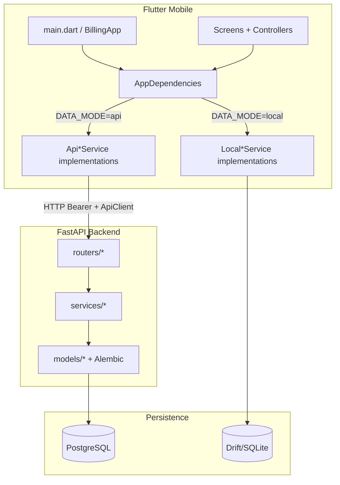

# Discovery: Khata App Repository Baseline

## Request As Understood

**No specific feature request was provided** in the Stage 0 input (template placeholders were empty). This discovery documents the **current repository baseline** so Stage 1 can scope and brainstorm a concrete feature without re-opening the full codebase.

**Inferred objective:** Enable the next delivery-chain stage to pick product scope against a wholesaler billing/khata system that already ships core flows in both API and offline-local modes.

## Repository Identity

| Field | Value | Evidence |
|---|---|---|
| Root | `/Users/abhishek/python_venv/khata_app` | workspace path |
| Remote | `git@github.com:abhishek2chikun/khata.git` | `git remote -v` |
| Branch | `main` | `git branch` |
| Baseline commit (discovery start) | `53886a6` — Merge PR #3 invoice PDF sharing | `git rev-parse` at discovery start |
| Current HEAD | `b326367` — Merge PR #4 buyer payment API fix | `git rev-parse HEAD` after sync |
| Origin/local sync | **Aligned** — fast-forward `53886a6..b326367` | `git pull --ff-only origin main` |
| Worktree | **Clean** after workflow artifact commit | `git status` |
| Layout | `backend/` (FastAPI), `mobile/` (Flutter), `docs/` | directory listing |
| Primary stack | Python 3.11+, FastAPI, SQLAlchemy, Alembic, PostgreSQL; Flutter/Dart 3.4+, Drift/SQLite | `backend/pyproject.toml`, `mobile/pubspec.yaml`, `README.md` |
| Workflow artifacts dir | **Created:** `docs/ai-workflow/khata-app-baseline/` | this run |
| CI | **None found** — no `.github/` workflows | glob search |

**Active local branches (not checked out):**

- `feature/offline-first-local-mode` @ `9280ea0`
- `feature/wholesaler-business-workflow` @ `707d8e6`
- `feature/invoice-pdf-sharing-buyer-link` @ `9ba5d49` (merged via PR #3)

## Instructions And Sources Read

| Source | Status | Notes |
|---|---|---|
| `README.md` | **Mostly current** | Run/test commands verified conceptually; backup schema version **stale** (says 6, code is 8) |
| `backend/agent.md` | **Current** | Module status, conventions, verification commands |
| `mobile/agent.md` | **Partially stale** | Test count says 291; actual run = **355**; deferred-work list still accurate |
| `docs/superpowers/specs/2026-04-19-internal-billing-khata-design.md` | Historical design | Superseded in part by wholesaler/offline specs |
| `docs/superpowers/plans/2026-04-19-internal-billing-khata-implementation.md` | **Stale checkboxes** | Plan tasks still `- [ ]` though implementation exists |
| `docs/superpowers/specs/2026-05-07-offline-first-local-data-design.md` | Reference | Local mode architecture |
| `docs/superpowers/plans/2026-05-07-offline-first-local-mode-implementation.md` | **Implemented** | Local mode, backup core, Drive skeleton |
| `docs/superpowers/specs/2026-05-09-canonical-wholesaler-schema.md` | Reference | Buyer/customer/product V2 schema |
| `docs/superpowers/plans/2026-05-09-wholesaler-business-workflow-implementation.md` | **Implemented** | Buyers, analytics, invoice V2, customer rename |
| `docs/android-testing-guide.md` | Reference | Emulator/device testing |
| Root `agent.md` | **Missing** | Only `backend/agent.md` and `mobile/agent.md` exist |

## Current Product/Technical State

Internal billing and khata app for a **small wholesaler**:

- **Buyers** = suppliers (payable ledger)
- **Customers** = retail shops (receivable/khata ledger)
- **Products** = inventory with V2 fields (`buyer_id`, `company_name`, `buying_price`, `selling_price`, GST-inclusive)
- **Invoices** = multi-line sales with payment states (`CREDIT`, `PARTIAL_PAID`, `TOTAL_PAID`), stock + ledger side effects
- **Analytics** = dashboard (revenue/profit by buyer/company/customer, top products, low stock, balances)

**Dual runtime modes:**

1. **API mode** (default): Flutter → FastAPI → PostgreSQL
2. **Local mode** (`DATA_MODE=local`): Flutter → Drift/SQLite on device, no backend required

Recent merged capability (PR #3): **invoice PDF generation** (`InvoicePdfService`) and **sharing** via system share sheet, WhatsApp deep link, SMS deep link (`InvoiceShareService`).

## Relevant Architecture And Data Flow

**Typical invoice create flow (both modes):**

1. UI: `CreateInvoiceScreen` → `InvoiceDraftController` (in-memory draft)
2. Preview: `InvoicePreviewScreen` → quote via `InvoicesService.quoteInvoice`
3. Confirm: `InvoicesService.createInvoice` with `request_id` for idempotency
4. Domain: stock decrement + customer ledger debit (+ collection if partial/total paid)
5. Detail/list: `InvoiceDetailScreen` / `InvoiceListScreen`; PDF via `InvoicePdfService`, share via `InvoiceShareService`

**Auth flow:**

- API: `HttpAuthService` + `SecureSessionStore` + `AuthController`; `ApiClient` refreshes on 401
- Local: `LocalAuthService` + first-user setup screen when no local users

**Backup flow (local only):**

- `LocalBackupService` encrypts/decrypts JSON envelope
- UI wired to `DriveBackupService` skeleton → shows configuration-required until external Drive setup

## Module And Symbol Map

| Area | Paths/symbols | Responsibility | Evidence |
|---|---|---|---|
| API entry | `backend/app/main.py` → `create_app()` | Router mount, error envelope, `/health`, `/collections` | file read |
| Auth | `backend/app/auth.py`, `routers/auth.py`, `services/auth_service.py` | JWT login/refresh/logout/me | routers grep |
| Products | `product_service.py`, `routers/products.py` | CRUD, archive, stock adjust | routers grep |
| Customers/Khata | `customer_service.py`, `routers/customers.py` | CRUD, opening balance, collections, adjustments, ledger | routers grep |
| Buyers/Payables | `buyer_service.py`, `routers/buyers.py` | CRUD, payable ledger entries | routers grep |
| Invoices | `invoice_service.py`, `routers/invoices.py` | quote, create, list, detail, cancel | routers grep |
| Analytics | `analytics_service.py`, `routers/analytics.py` | `/analytics/dashboard` | routers grep |
| Company profile | `company_profile_service.py`, `routers/company_profile.py` | Active company read/upsert | routers grep |
| Mobile composition | `mobile/lib/app/app_dependencies.dart`, `app_mode.dart` | Mode switch, service wiring | file read |
| Local DB | `mobile/lib/local/local_database.dart` `@DriftDatabase`, `schemaVersion => 8` | SQLite schema aligned to backend | grep |
| Local services | `mobile/lib/local/local_*_service.dart` | Drift-backed domain parity | directory |
| Invoice PDF | `mobile/lib/services/invoice_pdf_service.dart` | GST tax invoice PDF | grep |
| Invoice share | `mobile/lib/services/invoice_share_service.dart` | share_plus + url_launcher | file read |
| Backup | `mobile/lib/backup/local_backup_service.dart`, `backup_models.dart` | Encrypted export/import | grep |
| State | `InvoiceDraftController`, `AuthController` | Draft + session state | mobile/agent.md |

## Public Contracts And Invariants

**Backend HTTP:**

- Auth: `POST /auth/login`, `/refresh`, `/logout`; `GET /auth/me`
- Products: `POST/GET/PUT/DELETE /products`, `POST /products/{id}/adjust-stock`
- Customers: `POST/GET/PUT/DELETE /customers`, ledger + balance routes under `/customers/{id}/...`
- Buyers: `POST/GET /buyers`, ledger routes including `POST /buyers/{id}/payments-made`
- Invoices: `POST /invoices/quote`, `POST /invoices`, `GET /invoices`, `GET /invoices/{id}`, `POST /invoices/{id}/cancel`
- Analytics: `GET /analytics/dashboard`
- Collections: `POST /collections` (top-level, customer khata)
- Errors: `{ "error": { "code", "message" } }`
- Writes: `request_id` + canonical hashing for idempotency (invoice, ledger entries)

**Mobile compile-time config:**

- `DATA_MODE` → `api` (default) or `local`
- `API_BASE_URL` → optional override; else auto-detect (`10.0.2.2:8010`, `localhost:8010`, etc.)

**Backend env (prefix `BILLING_`):**

- `BILLING_DATABASE_URL` — PostgreSQL connection
- `BILLING_SECRET_KEY` — JWT signing (required non-dev)
- `BILLING_ALLOW_TEST_DATABASE_RESET=1` — opt-in destructive test reset

**Local backup envelope:**

- `schema_version`: **8** (`LocalBackupPayload.currentSchemaVersion`)
- `backend_compatibility_version`: **`local-v2`**
- Drift DB `schemaVersion`: **8**

**Financial invariants:**

- Append-only customer/buyer transaction ledgers; balances derived from transactions
- Invoice creation/cancellation owns stock + ledger side effects transactionally
- Money stored as canonical decimal strings locally; `Numeric` on server

## Data, Persistence, And External Dependencies

| Dependency | Role | Config / notes |
|---|---|---|
| PostgreSQL 16 | API mode primary store | Docker `khata-postgres`, port `55432`, db `internal_billing` / `internal_billing_test` |
| SQLite (Drift) | Local mode on-device | `sqlite3_flutter_libs`, schema v8 |
| JWT + Argon2 | Auth | `BILLING_SECRET_KEY`, passlib |
| Google Drive | Planned backup target | **Skeleton only** — OAuth/Firebase external |
| share_plus / url_launcher | Invoice PDF sharing | Production deps in pubspec |
| pdf package | Invoice PDF layout | `mobile/lib/services/invoice_pdf_service.dart` |

**Alembic migrations:** `0001`–`0008` under `backend/alembic/versions/` (auth → master data → seller ledger → invoices → product V2 → buyers → customer rename → invoice V2).

## Build, Test, Run, And Validation Commands

| Purpose | Command | Verified now? | Result/notes |
|---|---|---|---|
| Mobile unit/widget tests | `(cd mobile && flutter test test)` | **Yes** | **355 passed** (~37s) |
| Mobile expanded output | `(cd mobile && flutter test test -r expanded)` | No | Documented in README |
| Backend full suite | `BILLING_DATABASE_URL=.../internal_billing_test PYTHONPATH=backend .venv/bin/python -m pytest backend/tests -q` | **No** | Hung >5min — **Postgres container not confirmed running** |
| Backend E2E | `pytest backend/tests/api/test_end_to_end_flow.py -q` | No | Requires Postgres |
| API dev server | `uvicorn app.main:app --app-dir backend --reload --port 8010` | No | Documented in README |
| Flutter API mode | `(cd mobile && flutter run -d <device> --dart-define=DATA_MODE=api)` | No | Requires device + backend |
| Flutter local mode | `(cd mobile && flutter run -d <device> --dart-define=DATA_MODE=local)` | No | Documented |
| Local release APK | `(cd mobile && flutter build apk --release --dart-define=DATA_MODE=local)` | No | Needs JDK 17+ |
| Migrations | `(cd backend && BILLING_DATABASE_URL=... alembic upgrade head)` | No | Documented |
| Bootstrap user | `python -m app.commands.bootstrap_user --username owner ...` | No | Documented |
| Seed demo | `python -m app.commands.seed_demo_data --username owner` | No | Documented |

## Existing Test Coverage And Blind Spots

**Mobile (355 tests, verified):** auth, config, API services, invoice PDF/share, widgets (login, buyers, inventory, invoice flows), local Drift services, backup crypto/import validation, app shell.

**Backend (~30 test modules, unverified this run):** API routes for auth, products, customers, buyers, invoices, analytics, company profile; service unit tests for pricing, tax, idempotency, ledgers; wholesaler E2E (`test_wholesaler_end_to_end.py`).

**Blind spots / gaps (from code + agent.md):**

- No mobile UI for invoice cancel (API exists)
- No mobile UI for product archive, customer archive, manual stock adjust (API exists)
- Google Drive backup: interface + skeleton only; no real file I/O
- Platform background backup scheduling: adapter skeleton only
- No legacy Streamlit SQLite import utility
- No admin web UI
- WhatsApp/SMS share opens deep links but **does not attach PDF** to WhatsApp (by design in current impl)
- **Buyer payment API path mismatch on local HEAD** (see drift section)

## Documentation Drift And Contradictions

| Claim | Actual state | Severity |
|---|---|---|
| README: backup schema version **6** | Code: **8** (`backup_models.dart`, `local_database.dart`) | Medium — migration/restore docs wrong |
| mobile/agent.md: **291 tests** | **355 tests** pass | Low |
| Implementation plans: unchecked `- [ ]` tasks | Features implemented | Low — plans not maintained post-delivery |
| `ApiBuyersService.addPaymentMade` path | Backend route: `/buyers/{id}/payments-made` | **Resolved** on `b326367` (`1c0fccd`) |
| mobile/agent.md: `flutter_lints` analyzer warning | `analysis_options.yaml` references `flutter_lints` but not in `pubspec.yaml` | Low |

## Current Status By Capability

| Capability | Status | Evidence |
|---|---|---|
| Auth (API + local) | working | agent.md, tests |
| Products/inventory CRUD | working | routers, mobile screens |
| Customer khata ledger | working | routers, screens, tests |
| Buyer payable ledger | working | routers, screens, tests; API path fixed in `b326367` |
| Invoice quote/create/list/detail | working | services, screens, tests |
| Invoice cancel | partial | backend API; no dedicated mobile cancel UI |
| Invoice PDF + share | working | PR #3 merged, 355 tests include PDF/share |
| Analytics dashboard | working | API + local services |
| Offline local mode | working | DATA_MODE=local, local services |
| Encrypted backup core | working | LocalBackupService tests |
| Drive backup UI/scheduler | planned/skeleton | README, drive_backup_service |
| Local→server migration tool | planned | agent.md deferred |
| CI/CD | unverified/missing | no `.github/` |

## Risks And Fragile Areas

1. **Local main behind origin/main** — **resolved** via fast-forward to `b326367`.
2. **Postgres required for backend verification** — tests refuse destructive reset on non-test DB names unless `BILLING_ALLOW_TEST_DATABASE_RESET=1`.
3. **Dual-mode parity** — every API feature needs local service mirror; easy to drift (buyer path example).
4. **Schema version bumps** — backup import rejects mismatched versions; README/agent docs must stay aligned.
5. **Idempotency** — client must generate stable `request_id` on retries; ledger/invoice duplicates otherwise.
6. **Secrets** — default dev JWT secret in config; must override in production via `BILLING_SECRET_KEY`.
7. **Financial precision** — local strings vs server Numeric; migration must preserve decimals exactly.

## Confirmed Facts

- Monorepo: FastAPI backend + Flutter mobile for wholesaler billing/khata.
- Default mobile mode is API; local mode via `--dart-define=DATA_MODE=local`.
- Backend exposes full REST surface for auth, products, customers, buyers, invoices, analytics, company profile.
- Mobile composes API vs local services through `AppDependencies.create()`.
- Local Drift schema version **8**; backup schema **8** / compatibility **`local-v2`**.
- **355 mobile tests pass** on commit `53886a6` (2026-06-13 discovery run).
- Worktree clean; local `main` aligned with `origin/main` at `b326367`.
- Invoice PDF generation and sharing shipped in PR #3.

## Inferences And Assumptions

- Primary deployment target is **Android local-mode APK** (README emphasizes release APK build).
- Next feature work likely extends wholesaler workflow gaps (UI for cancel/archive/stock adjust) or backup/Drive integration — **requires Stage 1 product input**.
- Implementation plans under `docs/superpowers/plans/` were execution guides, not living status trackers.
- `feature/offline-first-local-mode` and `feature/wholesaler-business-workflow` branches may be stale relative to merged `main`.

## Unknowns And Stage-1 Decisions

1. **What feature is being built?** — User did not specify; Stage 1 must define scope.
2. **Should local `main` be fast-forwarded to `origin/main` before implementation?** — **Done** before workflow start.
3. **Target mode(s):** API only, local only, or both must stay in parity?
4. **Drive backup:** in-scope for next feature or explicitly out-of-scope (external config)?
5. **Backend test verification:** requires starting `khata-postgres` Docker container.
6. **Hybrid sync / local-to-server migration:** design says future; any near-term need?

## Recommended Reading Order

1. `docs/ai-workflow/khata-app-baseline/STATE.md` — workflow handoff
2. `README.md` — run/test commands and terminology
3. `mobile/agent.md` + `backend/agent.md` — module status and conventions
4. For invoice work: `invoice_service.py`, `local_invoices_service.dart`, `invoice_draft_controller.dart`
5. For ledger work: `customer_service.py`, `buyer_service.py`, matching `local_*` services
6. For local/backup: `local_database.dart`, `local_backup_service.dart`, `backup_models.dart`

## Context Loading Map

### Must read for Stage 1

- `docs/ai-workflow/khata-app-baseline/STATE.md`
- This file (`00-discovery.md`)
- `README.md` (terminology + commands)
- Relevant `agent.md` for touched stack (`mobile/` and/or `backend/`)

### Read on demand by topic

| Topic | Paths |
|---|---|
| Invoice domain | `backend/app/services/invoice_service.py`, `mobile/lib/services/invoices_service.dart`, `mobile/lib/local/local_invoices_service.dart`, `mobile/lib/state/invoice_draft_controller.dart` |
| PDF/share | `mobile/lib/services/invoice_pdf_service.dart`, `invoice_share_service.dart`, `screens/invoice_detail_screen.dart` |
| Buyer ledger | `backend/app/routers/buyers.py`, `mobile/lib/services/buyers_service.dart`, `mobile/lib/local/local_buyers_service.dart` |
| Customer khata | `backend/app/routers/customers.py`, `mobile/lib/services/customers_service.dart` |
| App wiring | `mobile/lib/app/app_dependencies.dart`, `mobile/lib/main.dart` |
| Backup | `mobile/lib/backup/*` |
| Schema/migrations | `backend/alembic/versions/`, `mobile/lib/local/local_database.dart` |
| Historical plans | `docs/superpowers/plans/*.md` |

### Raw evidence/artifacts by path

- Git: discovery started at `53886a6`; synced HEAD `b326367`
- Test run: 355 mobile tests passed (flutter test, 2026-06-13)
- Router inventory: `backend/app/routers/*.py`

## Evidence Eventually Required For Success

Depends on feature chosen in Stage 1. Baseline expectations:

- Mobile: `flutter test test` green; manual run on emulator/device for touched screens
- Backend: `pytest backend/tests` green against `internal_billing_test` with Postgres running
- If touching backup/schema: bump `schema_version` / update `LocalBackupPayload`, tests in `mobile/test/backup/`
- If touching API contracts: update both `backend/app/schemas/` and mobile models/services; add/adjust API + local tests
- If financial logic: verify idempotency, ledger append-only rules, decimal string handling
