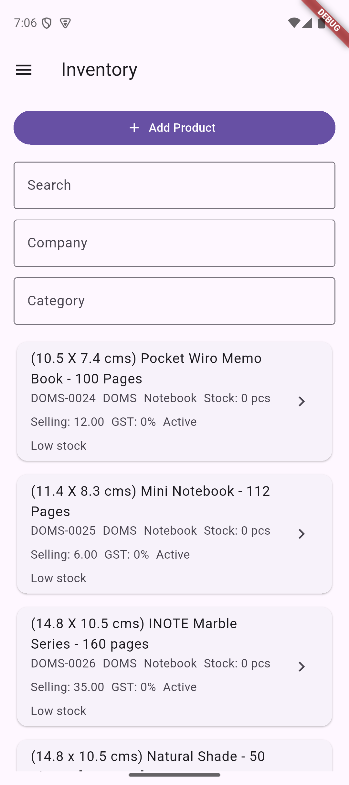
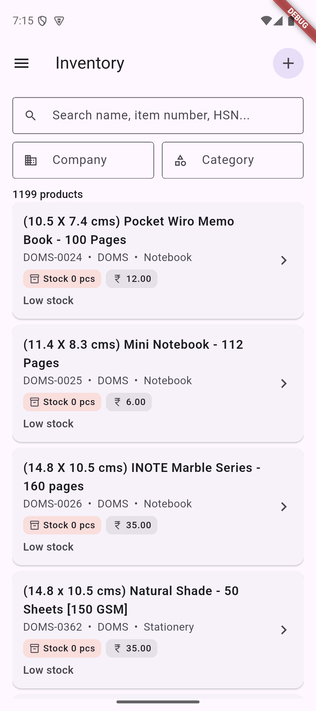
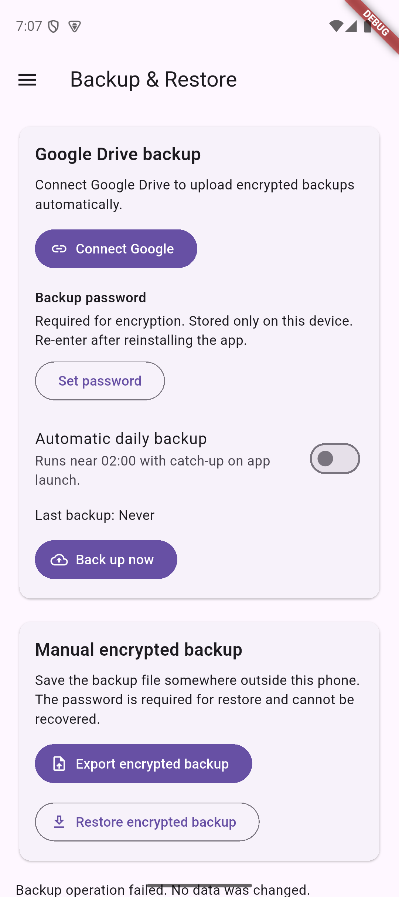
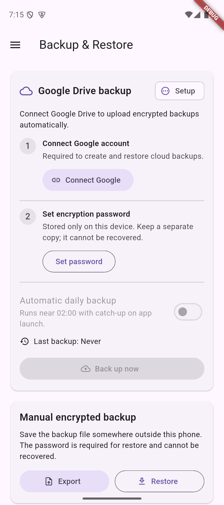

# Drive Backup And Workflow UI Evidence

Captured on the Pixel 9 API 35 Android emulator in local database mode on
2026-06-15.

## Inventory

Before: the primary action and three full-width fields consumed most of the
first viewport, and product metadata was presented as undifferentiated text.

After: add moved to the app bar, company/category filters share a row, the
result count is visible, and stock/price data is grouped into compact chips.

## Backup And Restore

Before: cloud prerequisites looked independent, invalid cloud actions remained
enabled, and failures appeared below the long page.

After: account and password setup are explicit steps, readiness is visible,
cloud scheduling/upload remain disabled until both prerequisites pass, manual
export/restore are compact, and action feedback appears at the top.

## Runtime Notes

- The 1,199-product catalog rendered without overflow in the revised inventory
  layout.
- The backup screen rendered without overflow at 1080 x 2424 emulator pixels.
- Missing or mismatched OAuth configuration is mapped to actionable package,
  signing SHA, `google-services.json`, and web client ID guidance.
- Real Drive upload and destructive restore still require a registered Google
  Cloud OAuth identity and a test account/device.
